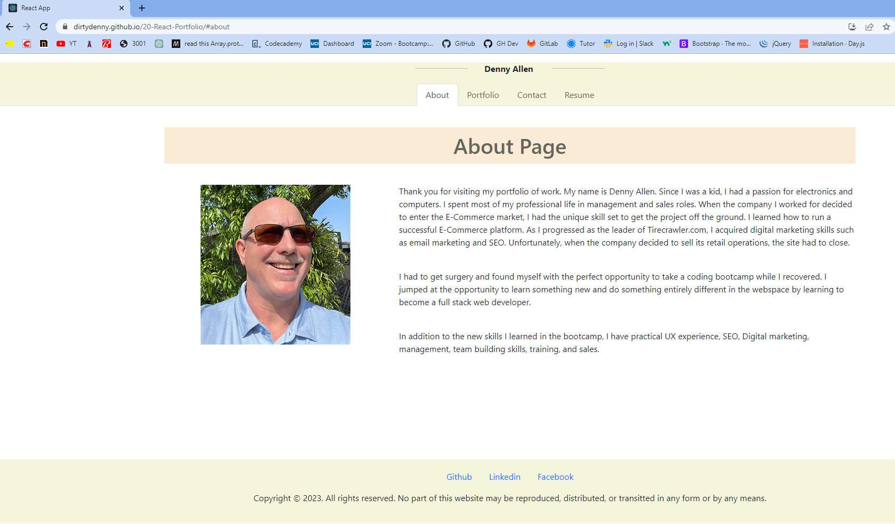

# React Portfolio

## Table of Contents  
[Description](#description)
  
[Installation](#installation)
  
[Usage](#usage)
  
[Questions](#questions)
  
[Tests](#tests)
    

  ## License 
     For more info, please follow the link below.
  [LINK](https://opensource.org/license/MIT)

  ## Description

  This project will be used to showcase the new skills I have been working on.

  ## Installation

  npm i

  ## Usage

  Navigate to the root directory to install and npm start.

  ## Tests

  none

  ## Questions

  Thank you for using my application.  Please submit questions to dallen7@socal.rr.com.  Also, visit me on Github at 
    [dirtydenny](https://github.com/dirtydenny/) to see my other programs.

  